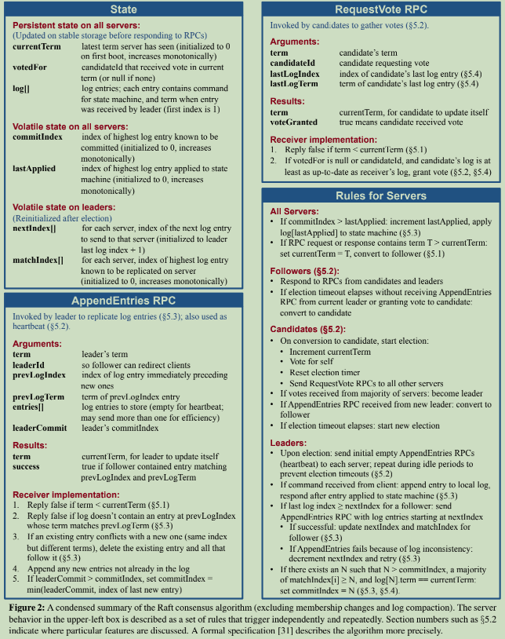

[The Paper](https://raft.github.io/raft.pdf)

Learn raft through this blog

https://github.com/eliben/raft

`ConsensusModule` is the core raft struct (**CM**). It forms a basic Node in raft. 

##### How a client finds a leader? 

##### Start Process

1. Initialize Nodes (n = 3)
2. start the election timers all together
3. one will become leader and add 1 to term. Others become followers. 

##### 

##### RPC round-trips to commit a new command

**Q:** How many RPC round-trips does it take to commit a new command?

**A:** Two. First round for the leader to send the next log entries to followers and for the followers to acknowledge them. When the leader processes a reply to an AE, it may update its commit index based on the response. The second round will send an updated commit index to followers, who will then mark these entries as committed and will send them on the commit channel. As an exercise, go back to the code snippets above and find the pieces of code that implement these steps.

#### Election safety

When a runaway server reconnects to the cluster, it might come back with higher term and start an election. 

So the normal leader in the cluster will become its follower but the comeback server won't win the election due to failure in completeness check. A winner has to win the majority of votes in the cluster with higher term (satisfied) and complete more log(not satisfied). 

This is because when a server disconnected from the cluster, it won't be able to get new logs anymore since it won't win election and become a leader. It starts self-spinning and get higer terms but no more logs. 

