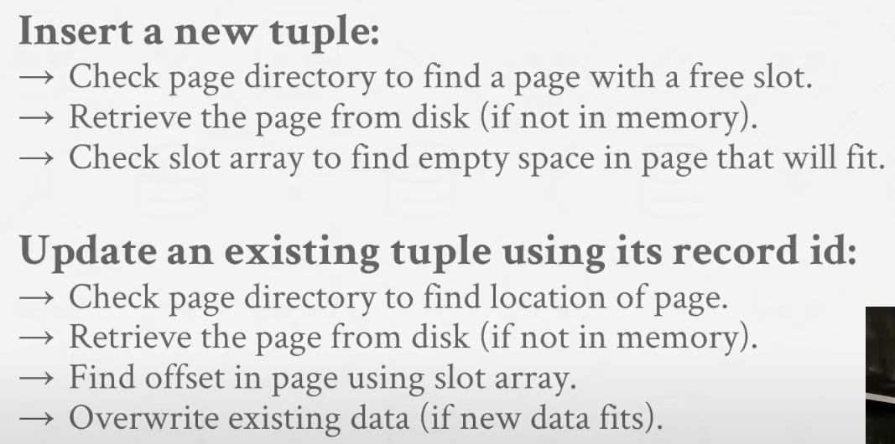

#### Disk-Oriented Arch

DBMS handle the flow between volatile memory and non-volatile disk. 

#### Page-Oriented Arch

Think: what are the problems with slotted page design. 

- **Fragmentation**. Delete tuples won't vaccum the space they take and sort them. 
- **Useless Disk I/O.** We need to bring entire page in when we want only a tuple inside. 
- **Random Disk I/O.**  (Update 20 tuples in 20 pages, read them all in and write them back out)

