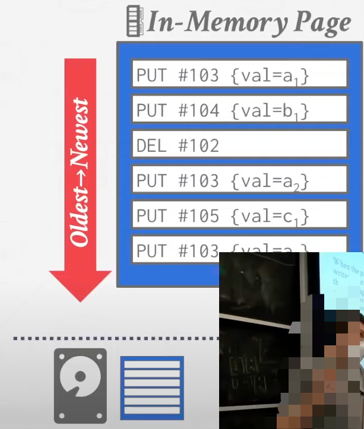

#### Disk-Oriented Arch

DBMS handle the flow between volatile memory and non-volatile disk. 

#### Page-Oriented Arch

Think: what are the problems with slotted page design. 

- **Fragmentation**. Delete tuples won't vaccum the space they take and sort them. 
- **Useless Disk I/O.** We need to bring entire page in when we want only a tuple inside. 
- **Random Disk I/O.**  (Update 20 tuples in 20 pages, read them all in and write them back out)

## Log Structure Storage

DBMS stores log record that contain changes to tuples (**PUT**, **DELETE**). 

Whenever the page is full, we write the page into the disk. 

- All disk writes are sequential. 
- On-disk pages are immutable. 

#### Read 

Read a tuple: 

- scan the log from newest to oldest for the tuple ID and values. 

  or

- Maintain an index that map a tuple ID to the newest log record. 

#### Compaction

The log grows forever. So we need to merge pages and consilidate them periodically. 

After a page is compacted, each tuple id is guaranteed to appear at most once in the page. 

Sort the page. 

Sorted String Tables (SSTables)
