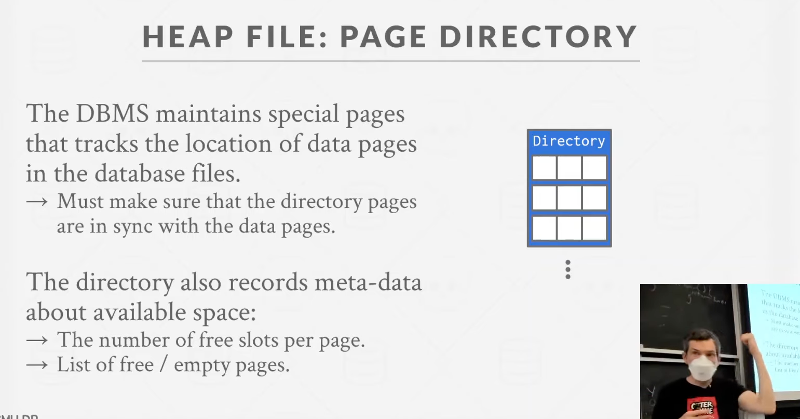
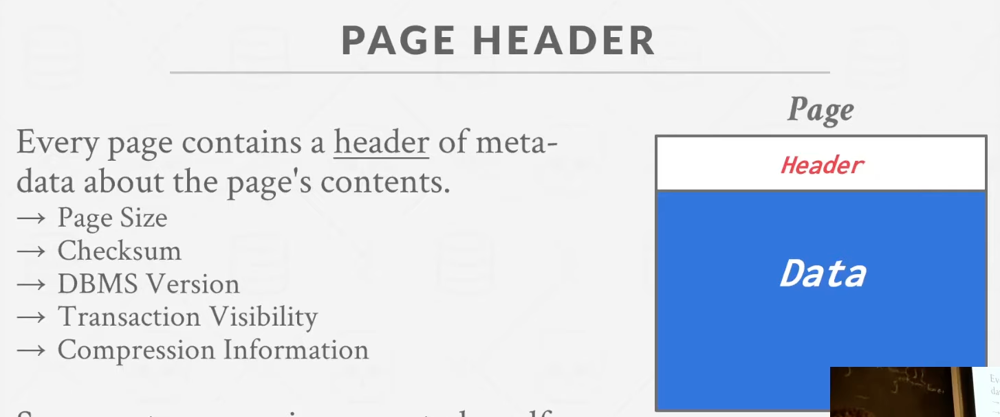
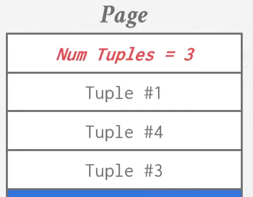
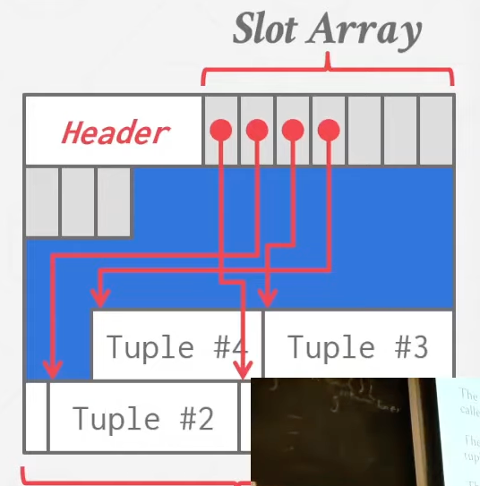
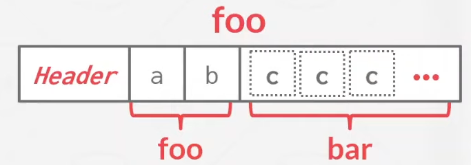

## Storage

Db is organized in pages. 

Heap file

## Page Layout

Page is like a table. For most DBs a single page will only hold a single table. But it can hold more than one. 

Oracle require pages to be self-contained.  Each page will  also store the schema and talbe info. 

But how do we store tuples in a page?

* Strawman Idea.  But you have to do linear search to find the tuple. **Super Slow**

**Slotted Pages (Most used)**

Slot array maps slots to tuples. 

The header keeps track of the num of used slots and the starting location of the last slot used. 

**Record IDs**

Track individual tuples. 

In postgres, it is named `ctid` 

## Tuple Layout

* Tuple is a flow of bytes. DBMS interpret them into structures. 
* 
* Denormalized tuple: pre-join related tuples and store them together in the same page. 

